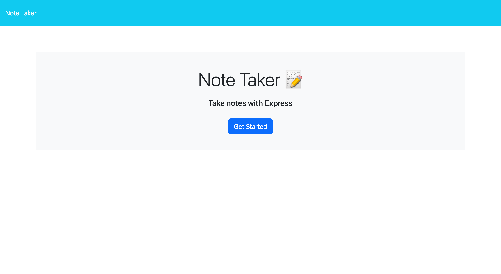
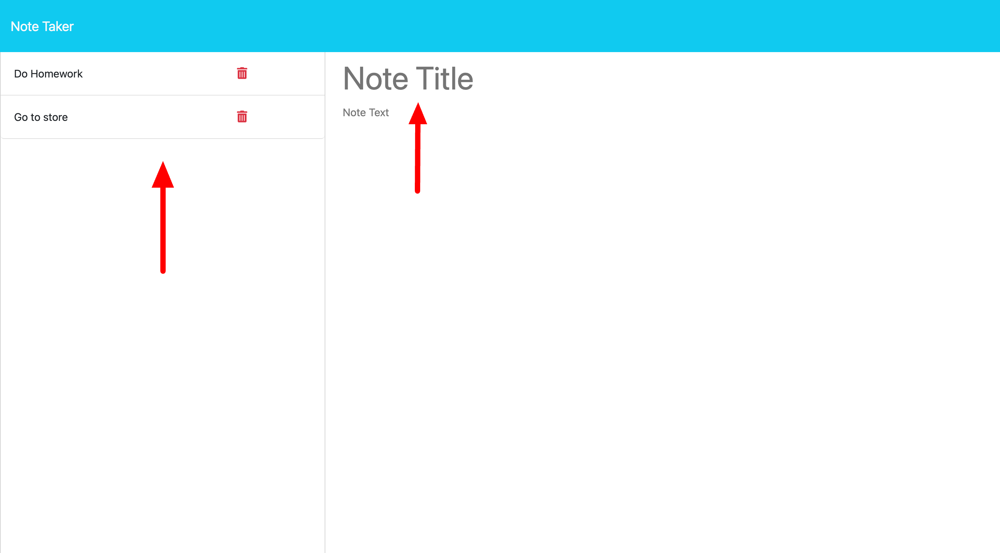
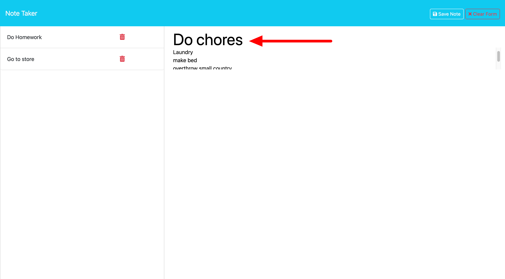
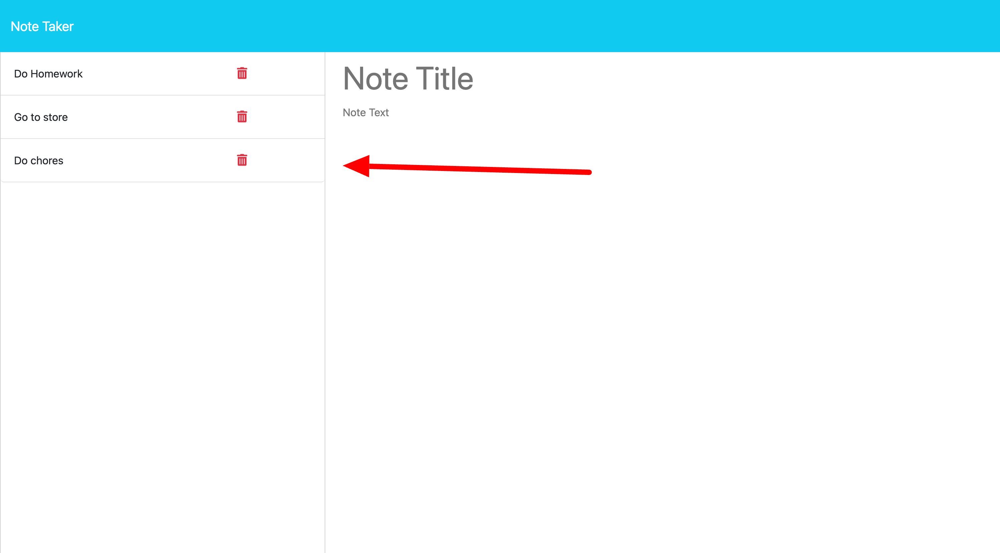
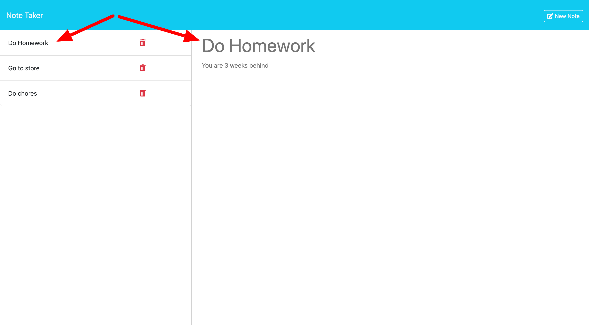

# notes-app

## Description

A notemaking application that uses backend databases to store notes the user makes. The user can see notes made previously and check them to see what was written.

## Table of Contents

- [Installation](#installation)
- [Usage](#usage)
- [Credits](#credits)
- [License](#license)
- [Contributing](#Contributing)
- [Test](#Tests)
- [Questions](#Questions)

## Installation

To install you need to use node.js, express and uuid intalled through node.js.

## Usage

Follow this link to the deployed application.
https://rocky-beach-09930-036ddda07d93.herokuapp.com/

When application loads you will see the home page. click the get started button to go to the notes page.

Here you can make new notes. On the side are notes already made and stored on the backend database.

in the center you can eneter a title for your new notes along with some text.

When you are done click the save note button and your note will be added to the database and displayed to to right.

You can view old notes by clicking them

## Credits

None at this time

## License
    
  

  https://opensource.org/licenses/MIT

## Contributing

Follow the link to my github account below

## Tests

None at this time.

## Questions

If you have any questions please reach out via email: markcurtiss720@gmail.com

or find me on Github: [markcurtiss720](https://github.com/markcurtiss720)

